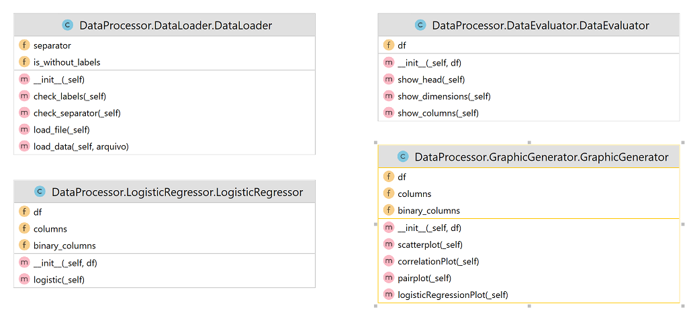

# Logistic Regression Web App made with Streamlit

Author: Leonardo Simões

## How to use the application
To access an application hosted on the Streamlit Community Cloud:
[Link](https://logistic-regression.streamlit.app)

To run the project locally after downloading it, install the dependencies and run the `streamlit run streamlit_app.py` command.

## Functionalities
Some of the functionalities applied to the dataset:
* display head;
* display dimensions;
* display column names;
* generate scatter plot;
* generate correlation plot;
* generate pairplot;
* generate logistic regression plot;
* calculate and display logistic regression parameters. 

## Class diagram
