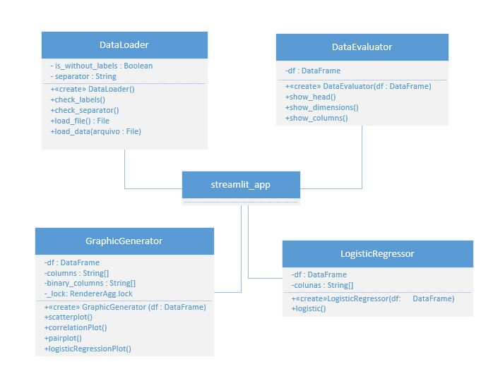

# Logistic Regression Web App made with Streamlit

Author: Leonardo Simões

URLs (temporary): 

https://share.streamlit.io/leosimoes/streamlit-logistic-regressor

https://leosimoes-streamlit-logistic-regressor-streamlit-app-zrddp5.streamlit.app/

Some of the functionalities applied to the dataset:
* display head;
* display dimensions;
* display column names;
* generate scatter plot;
* generate correlation plot;
* generate pairplot;
* generate logistic regression plot;
* calculate and display logistic regression parameters. 

## Class diagram

